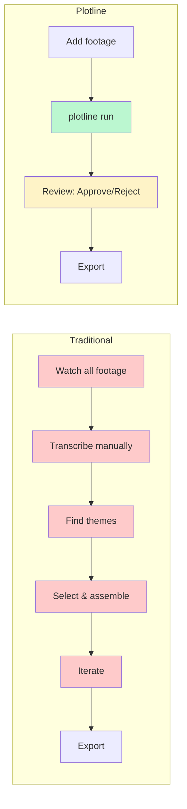

# Plotline

AI-assisted documentary editing toolkit that transforms raw video interviews into editable DaVinci Resolve timelines.

## Overview

Plotline analyzes interview footage to identify the most compelling moments and assembles them into a coherent narrative. It combines:

- **Whisper** for transcription
- **Librosa** for emotional delivery analysis
- **LLM** for theme extraction and narrative construction
- **EDL/FCPXML** export for professional NLEs

```
Video Interview → Audio → Transcript → Delivery Analysis → LLM Themes → Narrative Arc → EDL/FCPXML
```

## Workflow at a Glance

### Traditional vs Plotline



**Time savings:** ~85% reduction in editing time for 10+ hours of footage.

See [Workflow Diagrams](docs/workflow-diagram.md) for detailed comparisons, AI vs human responsibilities, and data flow architecture.

## Installation

```bash
# Clone and install
git clone https://github.com/your-org/plotline.git
cd plotline
pip install -e .                # All platforms (uses faster-whisper)
pip install -e ".[macos]"       # macOS Apple Silicon — adds mlx-whisper for faster transcription
```

### Optional: Speaker Diarization

To identify and filter speakers in your interviews:

```bash
pip install -e ".[diarization]"
```

This installs pyannote.audio and PyTorch for speaker identification. See the [Diarization Setup Guide](docs/diarization-setup.md) for HuggingFace token configuration.

**GPU acceleration (recommended):**
- **macOS**: Apple Silicon uses MPS automatically — no extra steps
- **Windows/Linux with NVIDIA GPU**: Install CUDA PyTorch first:
  ```bash
  pip install torch torchaudio --index-url https://download.pytorch.org/whl/cu121
  pip install -e ".[diarization]"
  ```

### Requirements

- **Python 3.11+** — Runtime environment
- **FFmpeg** — Extracts audio from video files for transcription

  ```bash
  # macOS
  brew install ffmpeg

  # Ubuntu/Debian
  sudo apt install ffmpeg

  # Windows
  winget install ffmpeg
  # Or with Chocolatey: choco install ffmpeg
  ```

- **Ollama** — Runs AI models locally for theme analysis and narrative construction. [Install Ollama](https://ollama.ai)
  ```bash
  # Pull a model (choose based on your RAM - see Hardware Requirements below)
  ollama pull llama3.1:70b    # 48GB+ RAM
  ollama pull llama3.1:8b     # 16GB+ RAM (faster, lower quality)
  ```

### Hardware Requirements

| Component | Minimum | Recommended | Notes |
|-----------|---------|-------------|-------|
| **RAM** | 8GB | 16GB+ | 70B model requires 48GB+ RAM |
| **Disk** | 20GB free | 50GB+ | Models are 4-40GB; projects grow with footage |
| **GPU** | None (CPU works) | Apple Silicon or NVIDIA | GPU accelerates transcription 5-10x |
| **CPU** | 4 cores | 8+ cores | More cores = faster processing |

**Model Selection by RAM:**

| Your RAM | Recommended Model | Quality | Speed |
|----------|------------------|---------|-------|
| 8-16 GB | `llama3.1:8b` | Good | Fast |
| 16-32 GB | `llama3.1:8b` or `mistral:7b` | Good | Fast |
| 32-48 GB | `llama3.1:70b` | Excellent | Medium |
| 48+ GB | `llama3.1:70b` | Excellent | Medium |

### Verify Installation

```bash
plotline doctor
```

## Quick Start

```bash
# 1. Create a project
plotline init my-doc --profile documentary
cd my-doc

# 2. Add video files
plotline add ~/Videos/interview1.mov ~/Videos/interview2.mov

# 3. Run the full pipeline
plotline run

# 4. Review selections
plotline review

# 5. Export timeline
plotline export --format edl
```

## CLI Reference

### Project Management

| Command                    | Description                |
| -------------------------- | -------------------------- |
| `plotline init <name>`     | Create a new project       |
| `plotline add <videos...>` | Add video files to project |
| `plotline status`          | Show pipeline progress     |
| `plotline doctor`          | Check dependencies         |
| `plotline validate`        | Validate project data      |

### Pipeline Stages

| Command               | Description                                    |
| --------------------- | ---------------------------------------------- |
| `plotline extract`    | Extract audio from videos                      |
| `plotline transcribe` | Transcribe using Whisper                       |
| `plotline diarize`    | Identify speakers (optional, requires extra install) |
| `plotline analyze`    | Analyze emotional delivery                     |
| `plotline enrich`     | Merge transcript + delivery                    |
| `plotline themes`     | Extract themes (LLM Pass 1)                    |
| `plotline synthesize` | Cross-interview synthesis (LLM Pass 2)         |
| `plotline arc`        | Build narrative arc (LLM Pass 3)               |
| `plotline flags`      | Cultural sensitivity flagging (LLM Pass 4)     |
| `plotline run`        | Run full pipeline                                 |

**Common flags:**
- `--force`, `-f` — Re-run even if already complete
- `--from <stage>` — Resume from a specific stage (e.g., `--from transcribe`)
- `--no-prompt`, `-q` — Skip interactive prompts (diarization)

### Reports

| Command                       | Description                              |
| ----------------------------- | ---------------------------------------- |
| `plotline report dashboard`   | Pipeline status dashboard                |
| `plotline report review`      | Selection review interface               |
| `plotline report summary`     | Project summary                          |
| `plotline report transcript`  | Per-interview transcript with waveform   |
| `plotline report coverage`    | Brief coverage matrix                    |
| `plotline report themes`      | Interactive theme explorer               |
| `plotline report compare`     | Cross-interview best take comparison     |
| `plotline report all`         | Generate all reports                     |

### Export

| Command                              | Description                                         |
| ------------------------------------ | --------------------------------------------------- |
| `plotline export --format edl`       | Export CMX 3600 EDL                                 |
| `plotline export --format fcpxml`    | Export FCPXML 1.11 with chapter markers             |
| `plotline export --all`              | Export all segments (ignore approvals)              |
| `plotline export --handle 24`        | Custom handle padding (frames)                      |
| `plotline export --alternates`       | Export alternate candidates as secondary timeline   |

### Approval Management

| Command                   | Description                              |
| ------------------------- | ---------------------------------------- |
| `plotline approve <id>`   | Approve a segment by ID                  |
| `plotline reject <id>`    | Reject a segment by ID                   |
| `plotline unapprove <id>` | Remove approval from a segment           |
| `plotline approvals`      | List all approval statuses               |

### Other

| Command                 | Description                              |
| ----------------------- | ---------------------------------------- |
| `plotline brief <file>` | Attach creative brief (Markdown/YAML)    |
| `plotline flags`        | Cultural sensitivity flagging (LLM)      |
| `plotline compare`      | Compare best takes (multi-interview)     |
| `plotline speakers`     | Manage speaker names and colors          |
| `plotline info`         | Show project configuration               |
| `plotline diagnose`     | Diagnose common issues                   |

## Pipeline Stages

### 1. Audio Extraction

Extracts 16kHz mono WAV for transcription and full-rate WAV for delivery analysis.

```bash
plotline extract
```

### 2. Transcription

Transcribes audio using faster-whisper (default, all platforms) or mlx-whisper (macOS Apple Silicon — install with `pip install plotline[macos]`). Language is auto-detected by Whisper and carried through the pipeline.

```bash
# Auto-detect language (recommended)
plotline transcribe

# Or specify explicitly
plotline transcribe --model medium --language es
```

### 3. Delivery Analysis

Analyzes speaker delivery using librosa:

- **RMS energy** — Volume/intensity
- **Pitch variation** — Vocal expressiveness
- **Speech rate** — Words per minute
- **Pause patterns** — Timing and pacing
- **Spectral features** — Voice quality

```bash
plotline analyze
```

### 4. Enrichment

Merges transcript and delivery data into unified segments.

```bash
plotline enrich
```

### 5. LLM Analysis

Four-pass LLM analysis:

| Pass | Command               | Purpose                              |
| ---- | --------------------- | ------------------------------------ |
| 1    | `plotline themes`     | Extract themes per interview         |
| 2    | `plotline synthesize` | Cross-interview theme synthesis      |
| 3    | `plotline arc`        | Build narrative arc, select segments |
| 4    | `plotline flags`      | Cultural sensitivity flagging (optional) |

Pass 4 runs automatically in `plotline run` when `cultural_flags: true` is set in config. It can also be run standalone with `plotline flags` (use `--force` to run even when disabled in config).

### 5.5. Speaker Diarization & Filtering (Optional)

Identify and filter speakers in interview audio. Useful for excluding interviewers from your final timeline.

**Prerequisites:**
1. Install extra: `pip install -e ".[diarization]"`
2. Create HuggingFace account and accept model terms (see [Diarization Setup Guide](docs/diarization-setup.md))
3. Set token: `export HUGGINGFACE_TOKEN=hf_xxx`

```bash
# Run diarization
plotline diarize

# Interactive prompts help you identify and exclude interviewers
? Exclude SPEAKER_00 from EDL? [Y/n] y
? Name SPEAKER_01: Jane Doe

# Continue pipeline
plotline run
```

Enable in `plotline.yaml`:
```yaml
diarization_enabled: true
```

> **Note:** After accepting HuggingFace model terms, wait for email confirmation (can take hours). See the [Diarization Setup Guide](docs/diarization-setup.md) for detailed instructions, GPU acceleration, and troubleshooting.

### 6. Export

Generate timeline files for NLEs:

```bash
plotline export --format edl       # DaVinci Resolve, Premiere Pro
plotline export --format fcpxml    # Final Cut Pro
plotline export --handle 24        # Custom handle padding (frames)
plotline export --alternates       # Alternate takes as secondary timeline
```

**Key features:**
- **Handles**: 12-frame padding by default (0.5s at 24fps), auto-reduced for tight edits
- **Chapter markers**: FCPXML includes markers at narrative role transitions
- **Alternates**: Export all candidates for take comparison

See the [Export Guide](docs/export-guide.md) for NLE import workflows, handle details, and format options.

## Language Support

Plotline supports non-English footage out of the box. Language is auto-detected by Whisper during transcription and carried through the entire pipeline.

**How it works:**

1. Whisper detects the spoken language during transcription
2. The detected language is stored on each interview in the manifest
3. All LLM prompts receive a bilingual instruction: English structural instructions with output (themes, summaries, narrative text) in the detected language
4. English projects get no extra instruction — zero overhead

**Supported languages:** Spanish, French, Portuguese, German, Italian, Japanese, Korean, Chinese, Arabic, Hindi, Russian, Dutch, Swedish, Norwegian, Danish, Finnish, Polish, Turkish, Thai, Vietnamese, Indonesian, Malay, and any other language Whisper can detect.

**Usage:**

```bash
# Auto-detect (recommended) — works for any language
plotline run

# Or specify language explicitly
plotline transcribe --language es
```

No additional configuration is needed. If all interviews are in the same language, LLM passes automatically output in that language. For mixed-language projects, the most common language is used.

## Configuration

Configuration is stored in `plotline.yaml`:

```yaml
project_name: my-documentary
project_profile: documentary

# LLM settings
llm_backend: ollama
llm_model: llama3.1:70b
privacy_mode: local

# Whisper settings
# whisper_backend auto-selects: 'mlx' on macOS Apple Silicon, 'faster-whisper' elsewhere
# Override explicitly if needed:
# whisper_backend: faster-whisper
whisper_model: medium
# whisper_language: es  # Optional — auto-detected if omitted

# Output settings
target_duration_seconds: 600
handle_padding_frames: 12

# Cultural sensitivity flagging (default: false)
# Enabled by default in commercial-doc profile
cultural_flags: false

# Speaker diarization (optional, requires pip install plotline[diarization])
diarization_enabled: false
diarization_model: "pyannote/speaker-diarization-3.1"

# Delivery weights (for scoring)
delivery_weights:
  energy: 0.15
  pitch_variation: 0.15
  speech_rate: 0.25
  pause_weight: 0.30
  spectral_brightness: 0.10
  voice_texture: 0.05
```

### LLM Backends

| Backend    | Description                         |
| ---------- | ----------------------------------- |
| `ollama`   | Local inference via Ollama          |
| `lmstudio` | Local inference via LM Studio       |
| `claude`   | Anthropic Claude (requires API key) |
| `openai`   | OpenAI GPT-4 (requires API key)     |

For cloud backends, set `privacy_mode: hybrid` and export API keys:

```bash
export ANTHROPIC_API_KEY=sk-...
export OPENAI_API_KEY=sk-...
```

## Profiles

Profiles customize delivery scoring and narrative style. Choose based on your project type:

| Project Type | Profile | Key Difference |
|--------------|---------|----------------|
| Documentary film, interviews | `documentary` | Emphasizes emotional authenticity |
| Corporate video, marketing | `brand` | Emphasizes message clarity |
| Branded doc, Indigenous content | `commercial-doc` | Hybrid + cultural sensitivity flags |

**Quick decision:**
- Making a traditional documentary? → `documentary`
- Creating marketing/corporate content? → `brand`
- Sponsored documentary or community storytelling? → `commercial-doc`

### Documentary

```yaml
project_profile: documentary
```

- Emphasis on emotional authenticity
- Higher weight on pauses and speech rate
- Emergent narrative structure
- Best for: Documentary films, interviews

### Brand

```yaml
project_profile: brand
```

- Emphasis on message clarity and energy
- Higher weight on energy and confidence
- Message-aligned structure
- Best for: Corporate videos, brand content

### Commercial Documentary

```yaml
project_profile: commercial-doc
```

- Hybrid of documentary and brand
- Balanced scoring
- Enables `cultural_flags` by default
- Best for: Branded documentaries, Indigenous content

## Creative Briefs

Attach a creative brief to guide LLM analysis:

```bash
plotline brief brief.md
```

Brief format:
```markdown
# Key Messages
- Innovation drives our success

# Target Duration
3-5 minutes

# Tone
Professional, confident
```

See the [Creative Briefs Guide](docs/creative-brief.md) for full format reference and examples.

## Reports

Interactive HTML reports for reviewing your project:

| Report | Command | Description |
|--------|---------|-------------|
| Dashboard | `plotline status --open` | Pipeline progress, interview cards |
| Review | `plotline review --open` | Approve/reject segments, keyboard shortcuts |
| Summary | `plotline report summary` | Executive summary, theme map |
| Transcript | `plotline report transcript --interview ID` | Waveform + delivery metrics |
| Coverage | `plotline report coverage` | Brief coverage matrix |
| Themes | `plotline report themes` | Interactive theme explorer |
| Compare | `plotline compare` | Cross-interview best takes |

All reports work offline and include audio playback. See the [Reports Guide](docs/reports-guide.md) for keyboard shortcuts and detailed features.

## Project Structure

```
my-project/
├── plotline.yaml          # Configuration
├── interviews.json        # Manifest + stage status
├── brief.json             # Parsed creative brief (optional)
├── approvals.json         # Review approvals (optional)
├── speakers.yaml          # Speaker names and colors (optional, auto-generated)
├── source/                # Extracted audio
│   └── interview_001/
│       ├── audio_16k.wav
│       └── audio_full.wav
├── data/
│   ├── transcripts/       # Whisper output
│   ├── diarization/       # Speaker diarization results (optional)
│   ├── delivery/          # Librosa analysis
│   ├── segments/          # Enriched segments
│   ├── themes/            # Per-interview themes
│   ├── synthesis.json     # Cross-interview synthesis
│   └── selections.json    # Arc selections (+ cultural flags)
├── prompts/               # LLM prompt templates
├── reports/               # HTML reports
└── export/                # EDL/FCPXML files
```

## Troubleshooting

**Common issues:**

| Issue | Solution |
|-------|----------|
| FFmpeg not found | `brew install ffmpeg` (macOS) or `winget install ffmpeg` (Windows) |
| Ollama not running | `ollama serve` then `ollama pull llama3.1:70b` |
| No approved segments | Run `plotline review --open` and approve segments |
| Diarization 401 error | Wait for HuggingFace model access confirmation (up to 24h) |

See the [FAQ](docs/FAQ.md) for detailed troubleshooting and solutions.

## Development

```bash
# Install dev dependencies
pip install -e ".[dev]"

# Run tests
pytest tests/

# Lint
ruff check plotline/

# Type check
pyright plotline/
```

## Documentation

- **[Getting Started](docs/getting-started.md)** — 5-minute quickstart
- **[Workflow Guide](docs/workflow-guide.md)** — End-to-end tutorial
- **[Export Guide](docs/export-guide.md)** — NLE export workflows, handles, alternates
- **[Reports Guide](docs/reports-guide.md)** — HTML reports and keyboard shortcuts
- **[Creative Briefs](docs/creative-brief.md)** — Guide LLM analysis with your goals
- **[FAQ](docs/FAQ.md)** — Common questions and solutions
- **[Documentation Index](docs/index.md)** — All guides and references

## What's New in v0.3.6

- **Smart Handles**: Handles automatically reduce when natural pauses are short
- **Chapter Markers**: FCPXML exports include chapter markers at role transitions
- **Alternates Export**: New `--alternates` flag for comparing takes in your NLE
- **Full Theme Export**: All themes now exported to FCPXML (previously truncated to 3)
- **User Notes Export**: Review notes now included in EDL/FCPXML exports

See [CHANGELOG.md](CHANGELOG.md) for full release history.

## License

MIT
